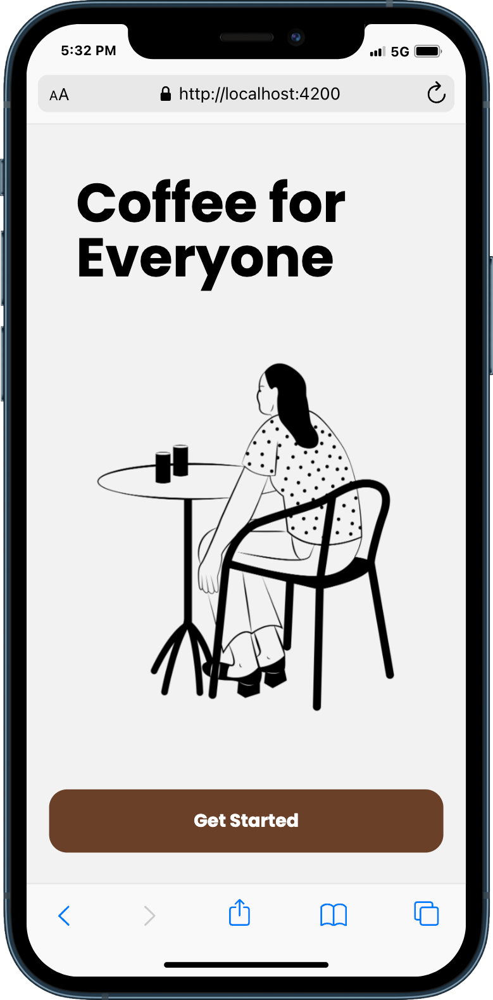
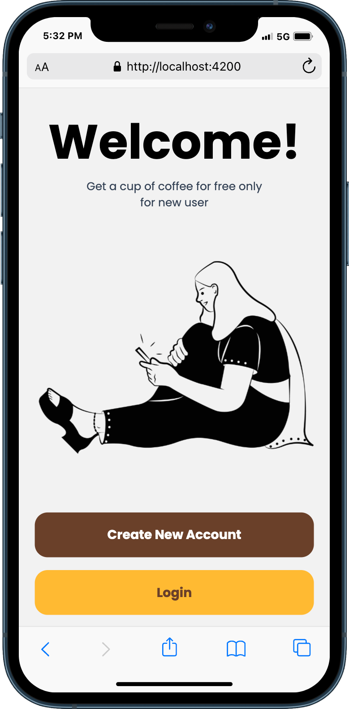
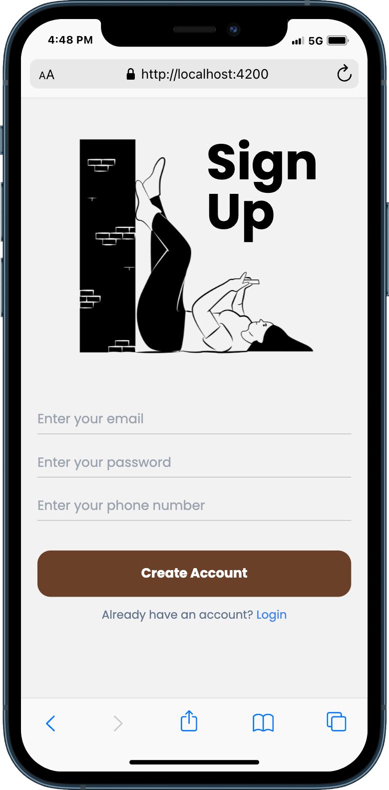
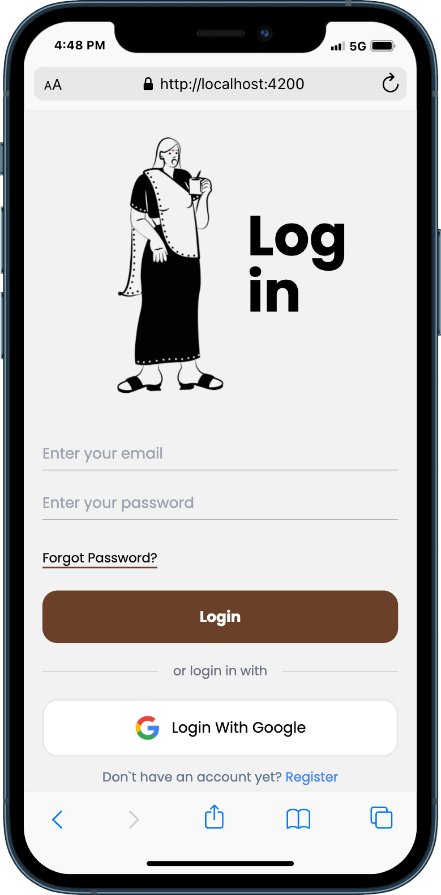
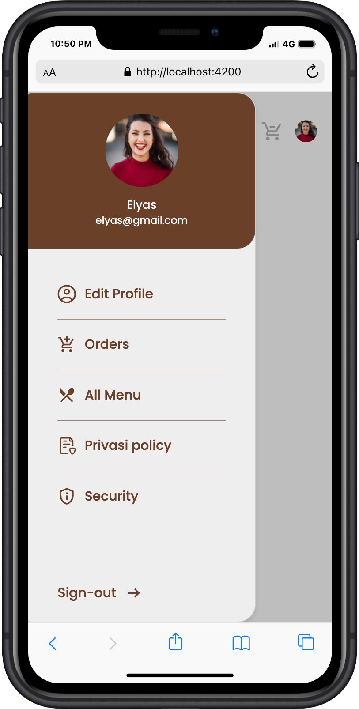

# Frontend Next

This is an example of a frontend project with Next

## Tech Stack

**Client:** NextJs, React Query, Axios, React Hook Form, Zod, TailwindCSS

## Run Locally

Clone the project

```bash
  git clone https://github.com/elyasprba/frontend-next.git
```

Go to the project directory

```bash
  cd frontend-next
```

Install dependencies

```bash
  npm install
```

Start the server

```bash
  npm run dev
```

## Environment Variables

To run this project, you will need to add the following environment variables to your .env file

`NEXT_PUBLIC_BE_HOST : http://localhost:8000`

## Related

Here are some related projects

[BACKEND PRISMA](https://github.com/elyasprba/backend-prisma)

## Features

- Get Started
- Welcome
- Register
- Login

## Screenshots

<div style="display:flex; gap: 10px" >






</div>
